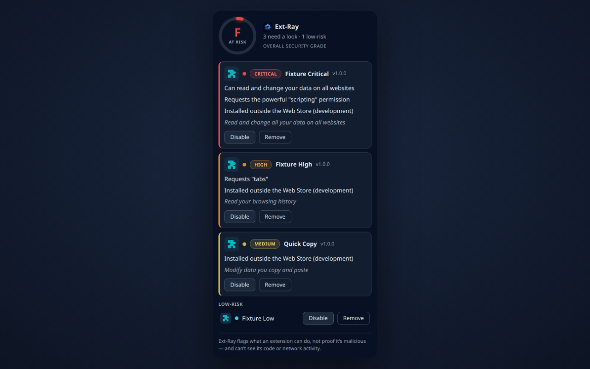
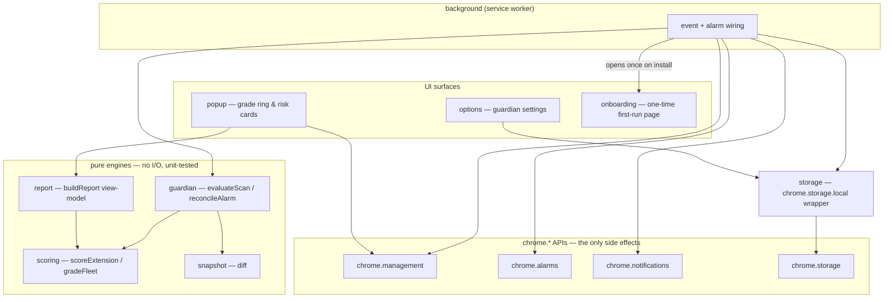
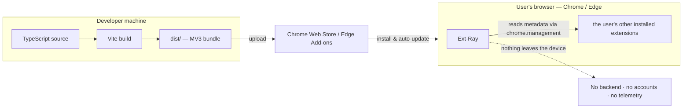
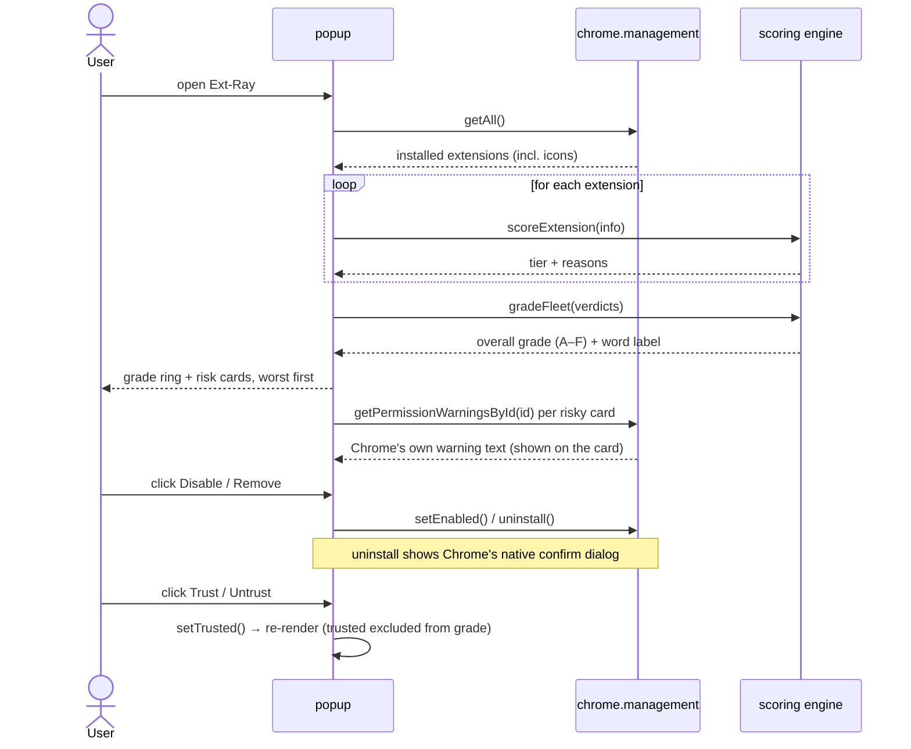
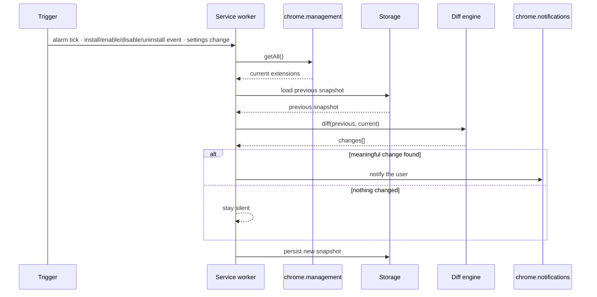
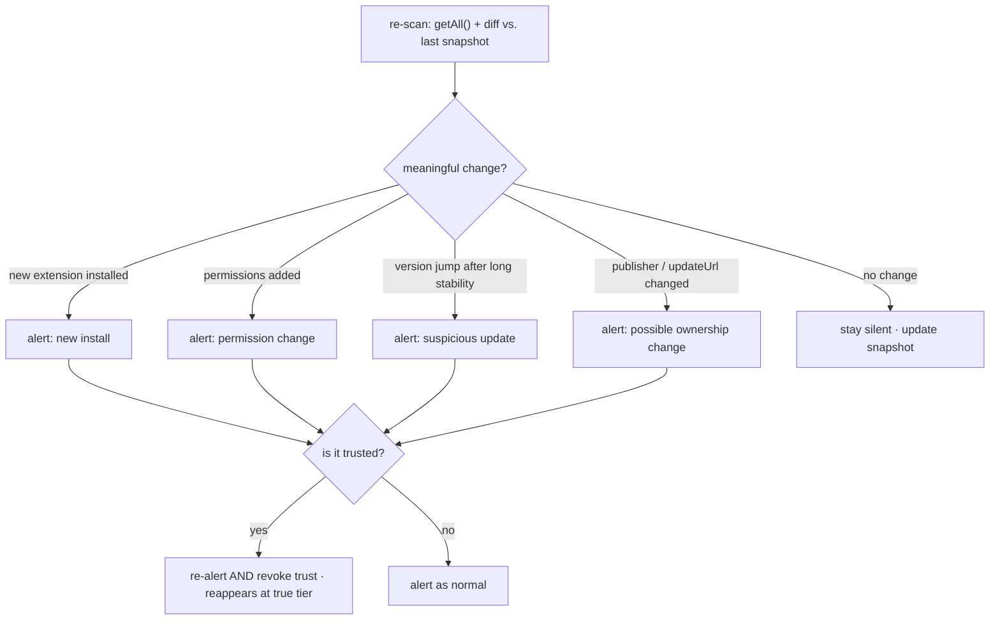
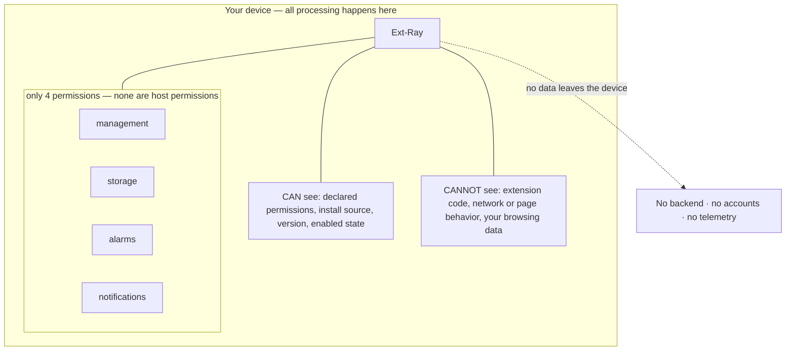

# Ext-Ray

**Audit the security of your _other_ browser extensions — entirely on your own device.**

Ext-Ray is a local-only Chrome/Edge (Manifest V3) extension that inspects every other
extension you have installed, grades its security risk in plain English, and quietly
watches for anything that changes _after_ you install it. No backend. No accounts.
Nothing leaves your browser.



> **Status:** Submission-ready (Phases 0–9.6 ✅) — scoring, snapshot-diff guardian, popup report
> with ring-gauge grade + real extension icons, options page, first-run onboarding, a shared
> OKLCH design system, MV3 build pipeline, a real-Chromium Playwright E2E suite
> (101 unit + 17 e2e tests), store screenshots (`npm run shots`), and the `docs/store/` submission
> kit. Remaining steps are owner-external (see
> [docs/store/submission-checklist.md](docs/store/submission-checklist.md)).
> See [docs/ROADMAP.md](docs/ROADMAP.md) for live status and the
> [design spec](docs/dev/specs/2026-06-05-ext-ray-design.md) for the architecture.
>
> On install, Ext-Ray opens a one-time onboarding page explaining its read-only, 100 %-on-device
> model and why it needs the `management` permission. Privacy policy:
> <https://junnythemarksman.github.io/Ext-Ray/privacy/>.

## Why it exists

Most people run 8–12 extensions but actively use only 2–3. The forgotten ones keep their
permissions — and the biggest real-world extension attacks of 2024–26 weaponized
_trusted_ extensions via a silent auto-update. Ext-Ray gives you a one-click read on
which of your extensions are risky and why, and warns you when one changes.

## How it works (in one breath)

Open the popup → see an overall security grade plus a card for each extension (risk tier,
plain-English reasons, one-click **Disable** / **Remove**). Recognise a legitimately-powerful
extension (say, a real antivirus)? **Trust** it: it collapses into a separate section and drops out
of the grade — but the guardian keeps watching it and **automatically re-alerts and un-trusts it the
moment it materially changes**. In the background, that guardian re-scans on a timer and on extension
install/enable/disable/uninstall events, and notifies you when an extension is newly installed or
**silently changes** after install (new permissions, a version bump after long stability, or a
publisher change).

## Architecture

The whole product is **four pure engines** (`scoring`, `snapshot`, `guardian`, `report`)
wrapped in thin browser glue. All real logic is I/O-free and unit-testable; the messy
`chrome.*` API surface is kept at the edges.



## Deployment

Build once with Vite, publish to the stores, run inside the browser. There is **no server
anywhere in the picture** — Ext-Ray reads other extensions' metadata locally and contacts
nothing.



## Data flow

### On-demand audit (the popup)



### Background guardian (continuous monitoring)



### What counts as a "meaningful change"

The guardian deliberately fires on **any silent change after install**, not just new
permissions — because the largest 2024–26 attacks added _no_ new permissions and instead
weaponized already-trusted extensions via an update.



## Security & trust model

Everything happens on your device, behind the smallest permission footprint that can do
the job. Ext-Ray is also honest about its limits: it reads what an extension _declares_,
not what its code _does_.



- Requests exactly **four permissions, none of them host permissions**:
  `management`, `storage`, `alarms`, `notifications`.
- **No** `<all_urls>`, no page/content access, no network calls to any server.
- **Read-only** by default — it never disables or removes anything without your click.
- It honestly tells you its limit: a high risk tier means an extension **can** do
  something powerful, **not** that it is malicious — most popular, trusted extensions
  legitimately hold broad permissions. Ext-Ray reads _declared_ permissions and install
  state, and **cannot** see an extension's actual code, the pages it injects, its network
  traffic, which permissions it truly uses vs. merely declares, or behavior hidden behind
  a trigger. It flags capability and silent change — never proven malice.

## Scope

**In:** Chromium (Chrome + Edge), local-only analysis, on-demand audit, the background
guardian, user-initiated disable/uninstall.

**Out (for now):** any backend/accounts, Firefox/Safari, automatic blocking/enforcement,
a malicious-extension reputation database, and code/behavioral analysis.

## Development

Vanilla TypeScript + Vite with **zero runtime dependencies** — a security tool shouldn't
ship a dependency tree. Dev dependencies are TypeScript, Vite, Vitest, and Playwright.

```bash
npm install
npx playwright install chromium   # once — for the e2e suite

npm run verify:build   # two-pass MV3 build + loadable-contract & permission checks
npm test               # unit tests (pure engines)
npm run test:e2e       # builds, then drives popup/options/onboarding in real Chromium
npm run typecheck      # strict tsc, no emit
npm run shots          # regenerate 1280×800 store screenshots from the real UI
```

To run it locally: `npm run build`, then `chrome://extensions` → enable **Developer mode**
→ **Load unpacked** → select the `dist/` folder. The onboarding tab opens once; the popup
audits whatever extensions that profile has installed.

Design specs and per-phase implementation plans live in [docs/dev/](docs/dev/);
the live status is [docs/ROADMAP.md](docs/ROADMAP.md).

## Donations

Ext-Ray is free, local-only, and has nothing to sell. If it's useful to you, a Bitcoin
donation helps keep it maintained:

```
bc1qux0rkwceymkq6nzya8wzzamj0amus6l35pzeq2
```

(Also available under **Support Ext-Ray** at the bottom of the extension's options page.)

## License

[GPL-3.0](LICENSE) — free to use, study, and modify; derivative works must remain open source.
